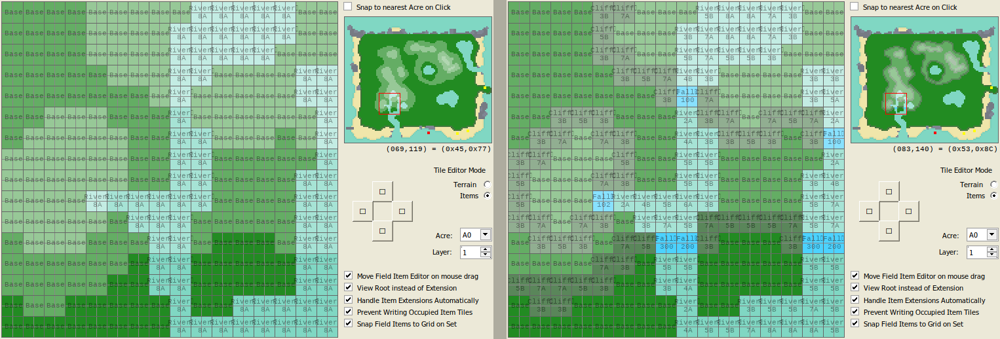

# NHSE Helper

Utility to help editing terrain in NHSE.

Handles the somewhat annoying step of manually configuring cliffs, riversides and waterfalls.

## Requirements

- Python >= 3.7
- Numpy >= 1.23.5
- Scipy >= 1.9.3
- Pillow >= 9.3.0 (for debug)

## How to use

In NHSE, set the terrain as wanted, only specifying types (grass or water) and elevation then dump all acres.

Use this tool to load the dumped file `terrainAcres.nht` and generate another file `terrainAcres_rectified.nht` with all correct terrain configuration.

Back in NHSE, import all acres with this new file

